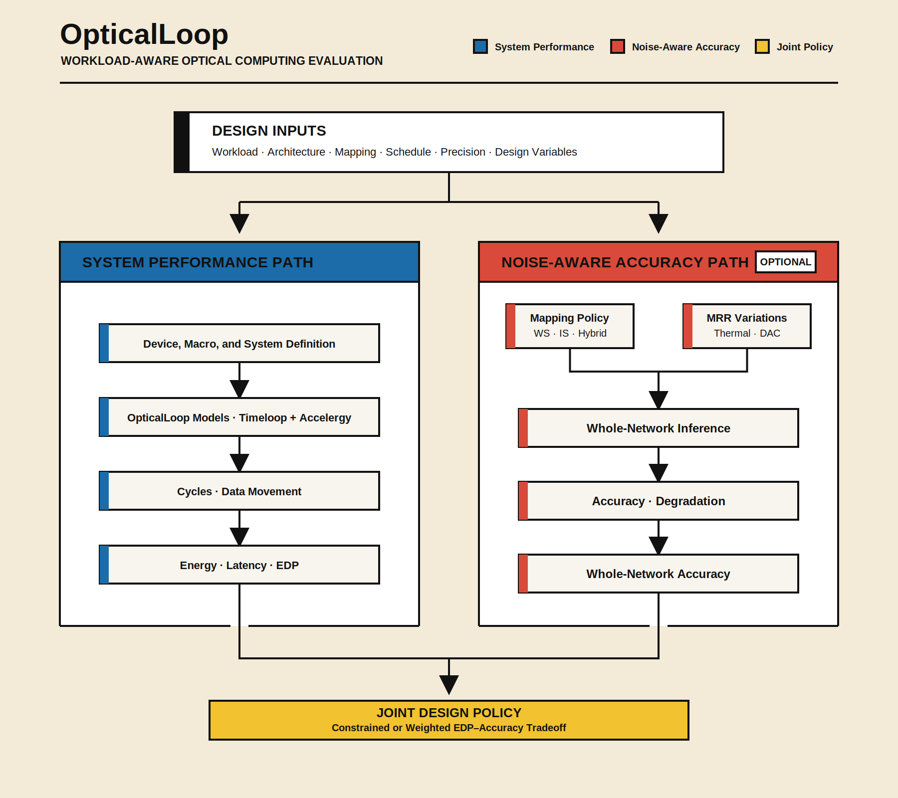

# OpticalLoop

OpticalLoop is a **research simulator for workload-aware, system-level evaluation of optical computing architectures**. Researchers can define their own optical modules, electronic conversion stages, memories, dataflows, quantization, and mapping constraints, then evaluate how those choices interact under real workloads.

## Why OpticalLoop

OpticalLoop emphasizes three capabilities:

1. **Workload-aware mapping and scheduling.** Performance is derived from the workload shape and the mapper loop nest, so WS/IS choices, reuse, tiling, temporal slicing, and scheduling can be compared across networks and layers.
2. **System-level performance instead of static power addition.** The model accounts for cycles, component actions, data movement, optical/electronic conversion, peripheral storage, and architecture hierarchy. This exposes ADC/DAC, accumulation, memory, and scheduling bottlenecks that a sum of static component powers cannot represent.
3. **Noise-aware accuracy and EDP co-design.** An optional whole-network path can apply MRR thermal and DAC variations to mapped inputs or weights, report accuracy, and join it with Timeloop-derived EDP for constrained or weighted mapping search.

<p align="center">
  <a href="docs/assets/opticalloop_overview.svg">
    
  </a>
</p>

The overview connects the native performance path and optional accuracy path at
an explicit design policy. Select the figure to inspect its full-resolution
labels.

OpticalLoop derives runtime metrics from native Timeloop/Accelergy schedules and
component actions. Every live `SimulationResult` crosses the `TimeloopBackend`
adapter and retains native mapper statistics and loop text; aggregate analyses
derive from the resulting job records. The separate accuracy adapter keeps its
model assumptions visible.

## Model Definition And Included Examples

Five separable concerns let a new paper or architecture reuse the same simulator:

| Concern | Repository representation |
| --- | --- |
| Workload | Tensor dimensions and operators under `workspace/models/workloads/`. |
| Architecture | Optical/electronic hierarchy and spatial structure in `arch.yaml`. |
| Component actions | Accelergy tables and plug-ins for lasers, MRRs, ADC/DAC, accumulators, buffers, and memory. |
| Mapping and scheduling | Timeloop constraints plus public variables controlling reuse, tiling, stationarity, and temporal execution. |
| Accuracy policy | Optional layer bindings, slice widths, stationarity, and MRR variation parameters under `config/accuracy/`. |

A reusable macro has the following form:

```text
workspace/models/arch/1_macro/<your_macro>/
├── arch.yaml                 # hierarchy, components, dataflow constraints
├── variables_free.yaml       # exposed design variables
├── variables_iso.yaml        # fixed/default variables
├── include_text_in_top.yaml  # Timeloop include boundary
└── components/               # component action energy and area tables

workspace/models/workloads/<your_network>/<layer>.yaml
```

### Three Design Lenses

The examples study three independent kinds of design decisions while reusing
the same action-based simulation path:

| Design lens | Example | Question answered |
| --- | --- | --- |
| Physical fabric | DEAP-CNNs | What hardware exists? |
| Execution mapping | ROSA WS/IS x OSA/no-OSA | How does the workload execute? |
| Design policy | ROSA EDP-Accuracy | Which design is selected? |

Start from the example closest to the question being studied. First identify
the variables to change, then state the boundary held fixed and inspect the
native evidence before expanding to a sweep.

### Example 1: DEAP-CNNs — Physical-Fabric Design

| Design field | This example |
| --- | --- |
| **Design question** | How do the optical array shape and converter placement affect utilization, component activity, energy, and schedule? |
| **Variables changed** | `N_Conv`, `N_ROWS`, `N_COLUMNS`, and the hierarchy of modulation, weighting, and readout devices. |
| **Boundary held fixed** | Workloads use explicit Timeloop tensors; all execution and accounting pass through the generic `TimeloopBackend`. |
| **Evidence to inspect** | Physical instance counts, utilization, component actions and energy, plus native mapper loop text. |
| **Implementation** | [`deap_cnns`](workspace/models/arch/1_macro/deap_cnns/) with two recorded cases in the [DEAP-CNNs guide](docs/deap_cnns.md). |

```text
conv_unit[N_Conv]
├── front modulation paths[N_COLUMNS]
├── channel_weight_row[N_ROWS]
│   └── wavelength_column[N_COLUMNS] -> weight MRR + virtual MAC
└── photodiode -> TIA -> ADC
```

This view treats an MRR accelerator first as a physical fabric: replication,
row/column geometry, fanout, and conversion placement define the hardware that
the mapper can use.

### Example 2: ROSA — Dataflow and Accumulation Design

| Design field | This example |
| --- | --- |
| **Design question** | With one core geometry, how do operand placement, stationarity, temporal slicing, and accumulation location change execution? |
| **Variables changed** | WS or IS, optical or electronic accumulation, and `front_mrr_slice_bits` in `{1,2,4,8}`. |
| **Boundary held fixed** | Each comparison keeps `N_TILES`, `N_PES`, `N_ROWS`, `N_COLUMNS`, total 8-bit operand precision, and physical MRR instances fixed. |
| **Evidence to inspect** | Mapper-loop stationarity, temporal cycles, conversion and accumulation actions, component energy, latency, and EDP. |
| **Implementation** | Four canonical macros documented in the [ROSA engineering guide](docs/rosa/README.md) and evaluated in the [multislice study](docs/rosa/multislice.md). |

<p align="center">
  <a href="docs/rosa/assets/rosa_system_hierarchy.png">
    
  </a>
</p>

The figure depicts the OSA hierarchy, where temporal partial products enter an
optical delay-line shift-and-add path before conversion. The no-OSA structures
move accumulation after the ADC; WS and IS retain the same core geometry while
changing front-operand placement and stationarity.

One ROSA PE contains `N_ROWS * N_COLUMNS` logical crosspoint MRRs and
`N_COLUMNS` front modulation paths. The execution choice is factored into two
independent axes:

```text
                              PARTIAL-PRODUCT ACCUMULATION
                         electronic (no OSA)       optical delay line (OSA)
                       +------------------------+--------------------------+
weight stationary     | mrr_ws_no_osa          | mrr_ws_osa               |
(WS: slice input)     | ADC -> digital S&A     | optical radix S&A        |
                       +------------------------+--------------------------+
input stationary      | mrr_is_no_osa          | mrr_is_osa               |
(IS: slice weight)    | ADC -> digital S&A     | optical radix S&A        |
                       +------------------------+--------------------------+
```

All four use `front_mrr_slice_bits`. Widths 1/2/4/8 produce 8/4/2/1 temporal
slices and 7/3/1/0 accumulations while preserving the same physical core.

### Example 3: ROSA — Noise-Aware Mapping Policy

| Design field | This example |
| --- | --- |
| **Design question** | Given per-layer mapping candidates, which network policy provides the preferred EDP-accuracy tradeoff? |
| **Variables changed** | Per-layer WS/IS choice, MRR thermal and DAC variation, accuracy constraint, and optimization objective. |
| **Boundary held fixed** | One network-level physical core, one layer manifest, and `network EDP = sum(layer energy) * sum(layer latency)`. |
| **Evidence to inspect** | Candidate trials, selected layer policy, Timeloop-derived network EDP, whole-network accuracy, and feasibility status. |
| **Implementation** | The [accuracy modeling guide](docs/accuracy_modeling.md), layer-policy YAML, and online-mapping configuration. |

```text
layer policy --> native Timeloop layer results --> network EDP --+
             +-> MRR-aware whole-network inference -> accuracy --+
                                                                v
                                                   feasibility + ranking
```

The implemented accuracy interface supports quantized ResNet18 with the 1-bit
hybrid policy. Readers supply the checkpoint and CIFAR-10 dataset described in
the accuracy guide to generate whole-network evidence. Wider 2/4/8-bit slice
choices remain `NOT_MODELED` for accuracy and continue to carry EDP-only
evidence.

### Shared Terminology

| Term | Meaning in this repository |
| --- | --- |
| WS | Weight stationary: the front input operand is temporally sliced; weights remain 8-bit. |
| IS | Input stationary: the front weight operand is temporally sliced; inputs remain 8-bit. |
| OSA | Optical shift-and-add using a delay line before electronic conversion. |
| no-OSA | Conversion first, followed by explicit electronic shift-and-add. |
| EDP | Network energy multiplied by network latency. |
| ASWM | Adaptive Slice-Width Mapping over explicit per-layer candidates. |

See the [modeling guide](docs/modeling.md) and [usage guide](docs/usage.md) for implementation details.

## Related Papers And Repository Implementations

The related work is separated by abstraction level. Architecture papers define optical accelerator organizations and dataflows; simulator and methodology papers provide the machinery used to map workloads and estimate system activity, energy, and latency.

### Architecture-Level Designs

| Work | Architecture contribution | Implementation in OpticalLoop | Reference |
| --- | --- | --- | --- |
| **ROSA** | Optical shift-and-add, robust MRR execution, and layer-wise hybrid mapping. | Primary architecture case: four WS/IS × OSA/no-OSA macros, native EDP sweeps, mapping validation, and a separate noise-aware accuracy path. | [Zhang et al., 2026](https://arxiv.org/abs/2605.00032) |
| DEAP-CNNs | Combines digital electronics with analog photonics for convolutional neural networks. | `deap_cnns` row/column macro and two workload examples through the generic backend; scope is documented in the DEAP-CNNs guide. | [Bangari et al., 2020](https://doi.org/10.1109/JSTQE.2019.2945540) |

### Simulator And Modeling Methodologies

| Work | Simulator/methodology contribution | Role in OpticalLoop | Reference |
| --- | --- | --- | --- |
| CiMLoop | Flexible, accurate, and fast modeling for compute-in-memory accelerators. | Provides the reusable architecture/component organization, action-based accounting, mapping flow, and result aggregation that OpticalLoop extends to heterogeneous optical/electronic systems. | [Andrulis, Emer, and Sze, 2024](https://doi.org/10.1109/ISPASS61541.2024.00012) |
| Timeloop | Systematic mapping-space exploration and performance evaluation for DNN accelerators. | Native mapping and scheduling engine behind every live performance result. | [Parashar et al., 2019](https://doi.org/10.1109/ISPASS.2019.00042) |
| Accelergy | Architecture-level action-based energy estimation. | Component action energy/area estimation for optical, conversion, electronic, buffer, and memory hierarchy components. | [Wu, Emer, and Sze, 2019](https://doi.org/10.1109/ICCAD45719.2019.8942149) |

### ROSA: Primary Paper And Implementation

ROSA is the project's main paper-backed design case. The paper proposes optical shift-and-add and layer-wise hybrid mapping for robust and energy-efficient MRR neural networks. OpticalLoop represents these ideas as explicit architecture, component, workload, and mapping files rather than as copied paper constants. Find the paper through [arXiv:2605.00032](https://arxiv.org/abs/2605.00032) or [Google Scholar](https://scholar.google.com/scholar?q=%22ROSA%3A+Robust+and+Energy-Efficient+Microring-Based+Optical+Neural+Networks+via+Optical+Shift-and-Add+and+Layer-Wise+Hybrid+Mapping%22).

| ROSA concept | Repository implementation | Validation status |
| --- | --- | --- |
| Optical shift-and-add | `mrr_ws_osa` and `mrr_is_osa` contain the optical delay-line accumulation path. | Native mapper structure, cycles, energy, and component checks pass. |
| Electronic accumulation baseline | `mrr_ws_no_osa` and `mrr_is_no_osa` convert first and use explicit digital shift-and-add. | OSA/no-OSA and 8-bit bypass equivalence are validated. |
| Layer-wise hybrid mapping | One layer policy selects WS or IS while retaining one network-level physical core. | Mapping stationarity is checked from mapper loop text. |
| Robust/noise-aware execution | The optional accuracy boundary applies MRR thermal and DAC variation to the mapped operand. | The deterministic quantized-ResNet18 interface supports the 1-bit/hybrid policy; readers generate results with their checkpoint and dataset. |
| Paper EDP comparisons | The DAC26 manifest runs 7,040 native jobs over six workloads. | `PASS_WITH_PAPER_GAPS`; undocumented inputs are reported rather than fitted. |
| Multislice extension | The separate 42,240-job study evaluates WS/IS × OSA/no-OSA with 1/2/4/8-bit temporal symbols. | Validated extension reported separately from the original-paper results. |

Evidence: [`examples/rosa/dac26_reference/REPORT.md`](examples/rosa/dac26_reference/REPORT.md), [`examples/rosa/mb_osa_reference/REPORT.md`](examples/rosa/mb_osa_reference/REPORT.md), and [`docs/accuracy_modeling.md`](docs/accuracy_modeling.md).

### How To Cite ROSA

```bibtex
@misc{zhang2026rosarobustenergyefficientmicroringbased,
  title={ROSA: Robust and Energy-Efficient Microring-Based Optical Neural Networks via Optical Shift-and-Add and Layer-Wise Hybrid Mapping},
  author={Huifan Zhang and Yun Hu and Caizhi Sheng and Yurui Qu and Pingqiang Zhou},
  year={2026},
  eprint={2605.00032},
  archivePrefix={arXiv},
  primaryClass={cs.AR},
  url={https://arxiv.org/abs/2605.00032},
}
```

## How To Run

The pinned Docker image is the authoritative clean-checkout environment for
Timeloop, Accelergy, and the `layer`, `reproduce`, and `multislice` workflows:

```bash
make doctor
make test
make smoke
make multislice-smoke
```

After defining `my_optical_core` and `my_network/0`, run one mapping and inspect the real loop nest:

```bash
docker compose run --rm opticalloop python3 optical_loop.py layer \
  --arch my_optical_core \
  --workload my_network/0 \
  --var MY_CORE_ROWS=16 \
  --var MY_CORE_COLUMNS=16 \
  --show-mapping
```

Run complete or explicitly bounded validation studies only when needed:

```bash
WORKERS=8 make full
WORKERS=8 MAX_JOBS=256 make full-batch
WORKERS=16 make multislice-full
WORKERS=16 MAX_JOBS=256 make multislice-full-batch
```

The separate `optical-loop` Conda environment supports the optional
PyTorch/CUDA accuracy runtime. Performance reproduction remains anchored to the
pinned Docker image and requires no editable parent-repository packages.

### CLI Migration

| Former command | Current workflow |
| --- | --- |
| `rosa --stage paper-edp` or `rosa --stage all` | `reproduce full`, followed by `reproduce analyze` or `reproduce validate` for an existing run. |
| `rosa --stage hybrid` | `multislice full` for WS/IS slice studies, or `optimize-mapping` for the implemented accuracy-aware policy. |
| `rosa --stage report` | Read the committed `dac26_reference/REPORT.md` or `mb_osa_reference/REPORT.md`. |

The public CLI consists of `layer`, `reproduce`, `multislice`, `accuracy`, and
`optimize-mapping`.

## Documentation Map

| Document | Purpose |
| --- | --- |
| [Modeling guide](docs/modeling.md) | Architecture hierarchy, component actions, Timeloop boundary, and canonical MRR dataflows. |
| [Usage guide](docs/usage.md) | CLI, Python API, run directories, reference bundles, and result schemas. |
| [ROSA engineering guide](docs/rosa/README.md) | MRR geometry, four mappings, temporal slicing, system activity, validation, and figures. |
| [DAC26 experiment](docs/rosa/dac26.md) | Clean-checkout EDP sweep, resume, analysis, and paper-gap interpretation. |
| [Multislice experiment](docs/rosa/multislice.md) | WS/IS multi-bit matrix, ASWM analysis, resources, and validation. |
| [Accuracy modeling](docs/accuracy_modeling.md) | Implemented ResNet18 MRR variation interface and online mapping boundary. |
| [DEAP-CNNs example](docs/deap_cnns.md) | Macro definition, two workloads, native metrics, and mapper loop text. |
| [Development guidelines](docs/development_guidelines.md) | OOP, KISS, adapter boundaries, and test expectations. |

## Model Boundaries

| Area | Repository boundary |
| --- | --- |
| Performance | Native Timeloop and Accelergy provide cycles, activity, energy, latency, and area. |
| Accuracy | The implemented accuracy path covers quantized ResNet18 with the documented 1-bit hybrid policy. Wider slice widths remain `NOT_MODELED`. |
| Generated data | Full run trees stay in ignored runtime directories; compact validated reference bundles are committed. |
| Publications | ROSA is cited through arXiv and Google Scholar. The repository tracks engineering PNG assets rather than manuscript TeX or complete paper PDFs. |

Generated local context such as `results/`, `paper/`, `reference/`, `temp/`, and `workspace/outputs/` remains outside version control.
