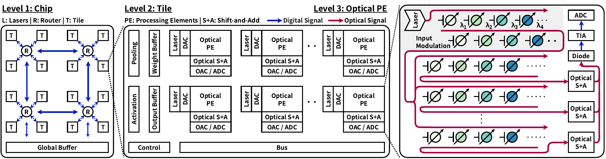
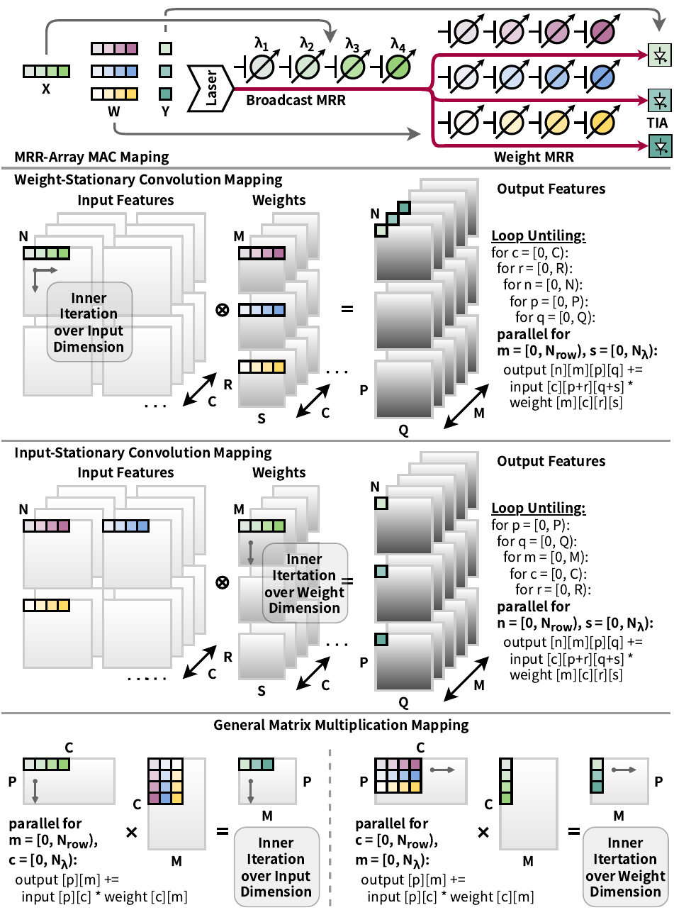
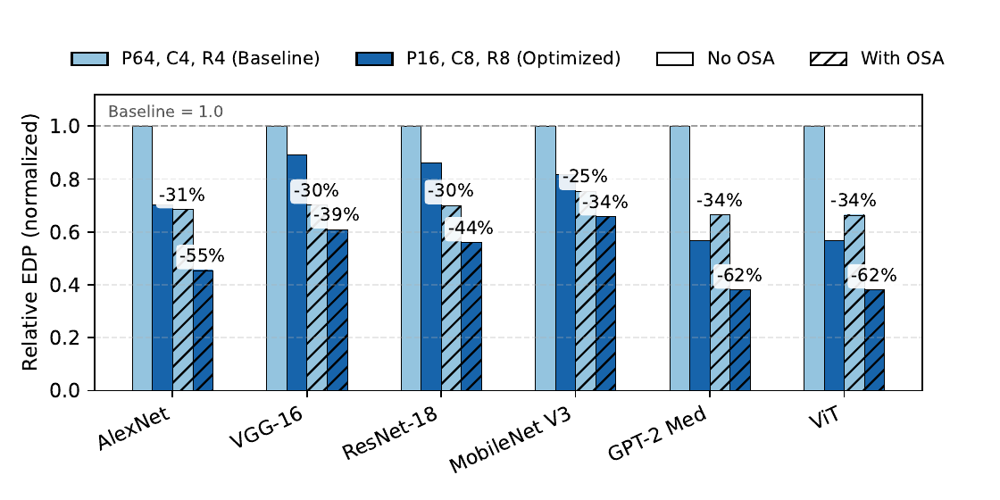
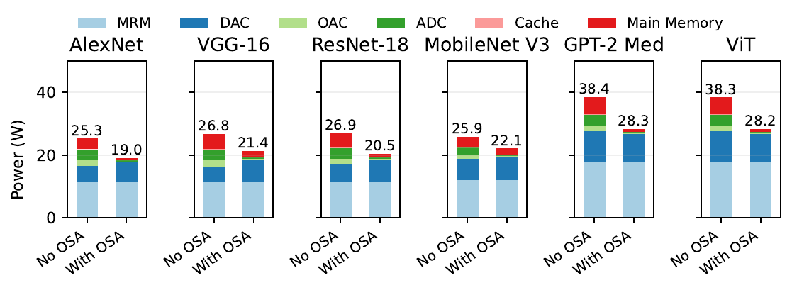

# ROSA Engineering Guide

The ROSA dataflow and accumulation design example holds the physical MRR fabric
explicit while comparing operand stationarity, temporal slicing, and optical
versus electronic accumulation. This guide covers the hierarchy, mapper
constraints, component actions, and validation. For paper-level motivation and
citation, see the [main README](../../README.md#rosa-primary-paper-and-implementation).

The figures below are publication-ready PNG assets exported from standalone
figures in the [ROSA paper](https://arxiv.org/abs/2605.00032). They provide
design context; authoritative regenerated
evidence lives in [`examples/rosa/dac26_reference`](../../examples/rosa/dac26_reference/REPORT.md)
and [`examples/rosa/mb_osa_reference`](../../examples/rosa/mb_osa_reference/REPORT.md).
The repository publishes these engineering figures while manuscript sources
remain with the paper.

## 1. System Hierarchy

<p align="center">
  <a href="assets/rosa_system_hierarchy.png">
    
  </a>
</p>

This manuscript figure follows the OSA hierarchy: temporal partial products
enter the optical shift-and-add path before photodetection and conversion. The
no-OSA macros place accumulation after the ADC. WS and IS preserve this
hierarchy and core geometry while changing operand placement and stationarity.

| Level | YAML representation | Engineering role |
| --- | --- | --- |
| System/chip | system template plus `glb` | Main-memory and global-buffer transfers. |
| Tile | `tile`, mesh `N_TILES` | Replicates weight-mapped macro groups. |
| Optical PE | `photonic_pe`, mesh `N_PES` | Replicates optical compute and conversion paths. |
| MRR array | `row[N_ROWS]` x `column[N_COLUMNS]` | Spatial optical multiply paths. |
| Readout | photodiode, TIA, ADC | Converts optical outputs into electronic values. |
| Accumulator | `delay_line` or `digital_shift_add` | Combines temporal radix slices. |

## 2. MRR Array Definition

One photonic PE contains `N_ROWS` row paths and `N_COLUMNS` wavelength/column paths. Their logical cross product forms `N_ROWS * N_COLUMNS` crosspoint MRR multiply sites. A separate set of `N_COLUMNS` front modulation paths broadcasts the sliced operand. Chip-level counts scale by `N_TILES * N_PES`.

| Parameter | Meaning | Changes physical MRR count? |
| --- | --- | --- |
| `N_TILES` | Tiles per chip. | Yes. |
| `N_PES` | Photonic PEs per tile. | Yes. |
| `N_ROWS` | Parallel array rows. | Yes. |
| `N_COLUMNS` | Wavelength/column paths per row. | Yes. |
| `FRONT_MRR_SLICE_BITS` | Bits carried by the sliced operand each cycle. | No. |
| `N_TEMPORAL_SLICES` | Number of temporal symbols for one 8-bit operand. | No. |

The physical array is therefore described by:

```text
front modulation paths per chip = N_TILES * N_PES * N_COLUMNS
crosspoint MRRs per chip         = N_TILES * N_PES * N_ROWS * N_COLUMNS
```

These are logical architecture counts. Timeloop component attributes remain the source of truth for area and action counts.

## 3. Mapping And Stationarity

<p align="center">
  <a href="assets/rosa_mapping_dataflows.png">
    
  </a>
</p>

The convolution and GEMM panels visualize the two execution mappings. WS
retains weights at crosspoint MRRs while the front input advances; IS retains
inputs while the front weight advances. Native mapper loop text is the
executable evidence for these bindings.

ROSA exposes two operand placements through separate macros:

| Mapping | Front operand | Crosspoint operand | Intended reuse | Mapper evidence |
| --- | --- | --- | --- | --- |
| WS | Sliced input through `input_dac` and `input_mrr` | 8-bit weight in `weight_mrr` | Weights stay in the array while inputs advance temporally. | WS accumulator traverses the input-side temporal dimension; row/column constraints reuse inputs appropriately. |
| IS | Sliced weight through `weight_dac` and `weight_mrr` | 8-bit input in `input_mrr` | Inputs remain stationary while weights advance temporally. | IS accumulator traverses the weight-side temporal dimension; PE spatial loops map output channels. |

Validation derives stationarity evidence from native mapper loop dimensions and reuse constraints.

## 4. Four Canonical Architectures

| Macro | Stationarity | Sliced operand | Accumulation | Architecture file |
| --- | --- | --- | --- | --- |
| `mrr_ws_no_osa` | WS | Input | Electronic after ADC | [`arch.yaml`](../../workspace/models/arch/1_macro/mrr_ws_no_osa/arch.yaml) |
| `mrr_ws_osa` | WS | Input | Optical delay line | [`arch.yaml`](../../workspace/models/arch/1_macro/mrr_ws_osa/arch.yaml) |
| `mrr_is_no_osa` | IS | Weight | Electronic after ADC | [`arch.yaml`](../../workspace/models/arch/1_macro/mrr_is_no_osa/arch.yaml) |
| `mrr_is_osa` | IS | Weight | Optical delay line | [`arch.yaml`](../../workspace/models/arch/1_macro/mrr_is_osa/arch.yaml) |

The four files encode two orthogonal choices only: operand stationarity and accumulation location. One shared variable controls bit width across all four files.

## 5. Temporal Slice Execution

Total operand precision remains 8 bits. The front MRR symbol width determines the radix and number of cycles:

| Slice bits | Radix | Temporal slices | Accumulations |
| ---: | ---: | ---: | ---: |
| 1 | 2 | 8 | 7 |
| 2 | 4 | 4 | 3 |
| 4 | 16 | 2 | 1 |
| 8 | 256 | 1 | 0 |

WS applies this resolution to the input DAC while keeping the weight path at 8 bits. IS applies it to the weight DAC while keeping the input path at 8 bits. Changing slice width changes temporal work and DAC actions while preserving the MRR-array geometry.

## 6. OSA And No-OSA Datapaths

```text
OSA:
laser -> front DAC/MRR -> crosspoint MRR array -> optical delay-line S&A
      -> photodiode -> TIA -> ADC -> output buffer

no-OSA:
laser -> front DAC/MRR -> crosspoint MRR array -> photodiode -> TIA -> ADC
      -> digital shift-and-add -> output buffer
```

`delay_line` and `digital_shift_add` are enabled only when `N_TEMPORAL_ACCUMULATIONS > 0`. At 8-bit slice width, both are bypassed; validation checks equal cycles and dynamic energy between OSA and no-OSA within tolerance.

## 7. System Activity And Energy Accounting

Each layer is scheduled by Timeloop. Accelergy evaluates the actions produced by that schedule. The result therefore includes workload-dependent activity rather than a static sum of component powers.

| Component group | Modeled activity |
| --- | --- |
| Memory hierarchy | Reads, writes, fills, updates, and data movement. |
| Laser and MRR paths | Active optical endpoints and modulation/weighting actions. |
| DAC | Resolution-specific operand conversion actions. |
| Photodiode/TIA/ADC | Output conversion actions driven by mapped output traffic. |
| Optical delay line | Per-slice optical accumulation actions. |
| Digital shift-add | Per-slice post-conversion accumulation actions. |
| Buffers | Workload- and mapping-dependent input/output storage traffic. |

Network EDP is computed after aggregation:

```text
network_energy = sum(layer_energy)
network_latency = sum(layer_latency)
network_EDP = network_energy * network_latency
```

## 8. Configuration Map

| Purpose | Path |
| --- | --- |
| Four architecture macros | `workspace/models/arch/1_macro/mrr_*` |
| Shared mapper rules | `workspace/models/include/` |
| Component models | Each macro `components/` directory and shared plug-ins |
| Six workload sets | `workspace/models/workloads/` |
| DAC26 EDP manifest | `examples/rosa/dac26_edp_manifest.yaml` |
| Multislice manifest | `examples/rosa/mb_osa_manifest.yaml` |
| Generic backend | `backend.py` |
| Full-run controller and validator | `applications/rosa/reproduction.py`, `applications/rosa/multislice.py` |

## 9. Engineering Commands

Validate the pinned native environment:

```bash
make doctor
```

Run one layer and inspect its real mapping:

```bash
docker compose run --rm opticalloop python3 optical_loop.py layer \
  --arch mrr_ws_osa \
  --workload alexnet/0 \
  --tiles 1 --pes 16 --cols 8 --rows 8 \
  --front-mrr-slice-bits 1 \
  --show-mapping
```

Run end-to-end smoke tests:

```bash
make smoke
make multislice-smoke
```

Run complete sweeps or explicit resumable batches:

```bash
WORKERS=8 make full
WORKERS=8 MAX_JOBS=256 make full-batch
WORKERS=16 make multislice-full
WORKERS=16 MAX_JOBS=256 make multislice-full-batch
```

Analyze or independently validate an existing run:

```bash
docker compose run --rm opticalloop python3 optical_loop.py multislice analyze \
  --run-dir multislice-runs/<run-id>
docker compose run --rm opticalloop python3 optical_loop.py multislice validate \
  --run-dir multislice-runs/<run-id>
```

## 10. Validation Invariants

The multislice validator checks:

- exact job and workload-layer coverage;
- unique deterministic job IDs and zero failed jobs;
- temporal slice counts `8/4/2/1` and accumulation counts `7/3/1/0`;
- stationarity from native mapper loop text;
- correct delay-line versus digital-accumulator selection;
- invariant MRR area/count across slice widths;
- DAC resolution and energy applied to the sliced operand;
- 8-bit OSA/no-OSA bypass equivalence;
- consistent units, frequency, and `EDP = energy * latency`.

## 11. Manuscript Figures And Regenerated Evidence

These manuscript figures supply visual context for the reported
architecture-level behavior. In their notation, `T`, `P`, `C`, and `R`
correspond to `N_TILES`, `N_PES`, `N_COLUMNS`, and `N_ROWS`. `MRM` denotes
microring modulation, while `OAC` denotes optical-to-analog conversion modeled
by the photodetector and TIA readout path. The reports and executed notebooks
below contain regenerated values produced by the pinned simulator.

### Manuscript Context — OSA EDP Comparison

<p align="center">
  <a href="assets/rosa_osa_edp.png">
    
  </a>
</p>

### Manuscript Context — Component Power Breakdown

<p align="center">
  <a href="assets/rosa_power_breakdown.png">
    
  </a>
</p>

For regenerated numerical evidence, inspect:

- [`DAC26 EDP report`](../../examples/rosa/dac26_reference/REPORT.md)
- [`WS/IS multislice report`](../../examples/rosa/mb_osa_reference/REPORT.md)
- [`DAC26 executed notebook`](../../examples/rosa/dac26_reference/dac26_edp_reproduction.executed.ipynb)
- [`Multislice executed notebook`](../../examples/rosa/mb_osa_reference/mb_osa_aswm_experiments.executed.ipynb)

## 12. ROSA Citation

```bibtex
@misc{zhang2026rosarobustenergyefficientmicroringbased,
  title={ROSA: Robust and Energy-Efficient Microring-Based Optical Neural Networks via Optical Shift-and-Add and Layer-Wise Hybrid Mapping},
  author={Huifan Zhang and Yun Hu and Caizhi Sheng and Yurui Qu and Pingqiang Zhou},
  year={2026},
  eprint={2605.00032},
  archivePrefix={arXiv},
  primaryClass={cs.AR},
  url={https://arxiv.org/abs/2605.00032},
}
```
